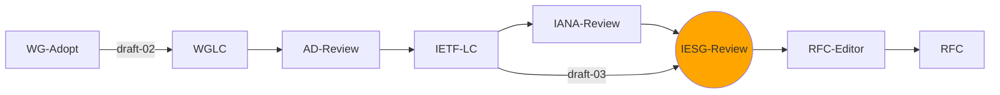
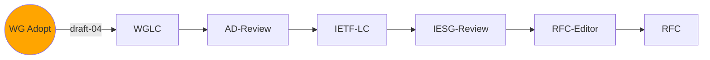
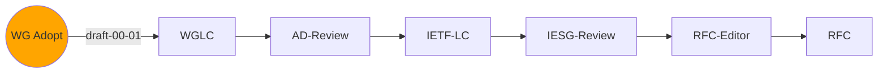
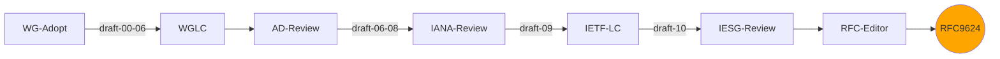
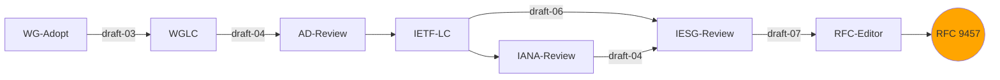
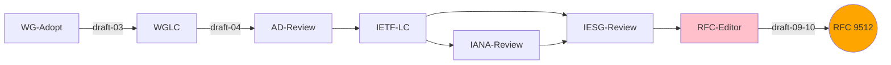

This is the home page of the [IETF](https://www.ietf.org/) Building Blocks for HTTP APIs (HTTPAPI) Working Group.

{: .banner}
Our mission is to create standard technical specifications to improve use of HTTP for machine-to-machine communications, including HTTP extensions, formats, and best practices.

See our:

* [Charter](https://datatracker.ietf.org/wg/httpapi/about/) - our scope of work
* [Working Group Materials](https://github.com/ietf-wg-httpapi/wg-materials) - agendas, minutes, etc.
* [Mailing list](https://www.ietf.org/mailman/listinfo/httpapi) - announcements, calls for consensus, and general discussion of our work
* [Discussion repo](https://github.com/ietf-wg-httpapi/discussion/discussions) - alternative venue for discussing ideas about new specifications

## Current and Upcoming Work [Updated March 2024]

The group is currently working on the following specifications (in the GitHub repository indicated). The step in the progress graph with an orange circle represents the current state of the document. The pink colour indicates the status at the last IETF meeting :

#### [Link-Template HTTP Header Field](https://datatracker.ietf.org/doc/draft-ietf-httpapi-link-template/) - _[repository](https://github.com/ietf-wg-httpapi/link-template)_

#### [The Idempotency-Key HTTP Header Field](https://datatracker.ietf.org/doc/draft-ietf-httpapi-idempotency-key-header/) - _[repository](https://github.com/ietf-wg-httpapi/idempotency)_

#### [RateLimit Fields for HTTP](https://datatracker.ietf.org/doc/draft-ietf-httpapi-ratelimit-headers/) - _[repository](https://github.com/ietf-wg-httpapi/ratelimit-headers)_

#### [REST API Media Types](https://datatracker.ietf.org/doc/draft-ietf-httpapi-rest-api-mediatypes/) - _[repository](https://github.com/ietf-wg-httpapi/mediatypes)_

#### [The Deprecation HTTP Header Field](https://datatracker.ietf.org/doc/draft-ietf-httpapi-deprecation-header/) - _[repository](https://github.com/ietf-wg-httpapi/deprecation-header)_

#### [API Catalog](https://datatracker.ietf.org/doc/draft-ietf-httpapi-api-catalog/)

#### [Byte Range Patch](https://datatracker.ietf.org/doc/draft-ietf-httpapi-patch-byterange/)

#### [Authentication Link Relations](https://datatracker.ietf.org/doc/draft-ietf-httpapi-authentication-link/)

#### [Link Hint](https://datatracker.ietf.org/doc/draft-ietf-httpapi-link-hint/)

## Completed Work

#### [Linkset: Media Types and a Link Relation Type for Link Sets](https://datatracker.ietf.org/doc/draft-ietf-httpapi-linkset/) - _[repository](https://github.com/ietf-wg-httpapi/linkset)_

#### [Problem Details for HTTP APIs](https://datatracker.ietf.org/doc/draft-ietf-httpapi-rfc7807bis/) - _[repository](https://github.com/ietf-wg-httpapi/rfc7807bis)_

#### [YAML Media Type](https://datatracker.ietf.org/doc/draft-ietf-httpapi-yaml-mediatypes/) - _[repository](https://github.com/ietf-wg-httpapi/mediatypes)_

See also the [official document listing](https://datatracker.ietf.org/wg/httpapi/documents/).

We talk about potential future work on the mailing list and in the [discussion repo](https://github.com/ietf-wg-httpapi/discussion/discussions).

## Who Should Participate

We think that the following sorts of people will be able to effectively contribute to this work:

* **HTTP standards experts**: Those with deep understanding of and experience with the protocol
* **API practitioners**: Those who create, operate, and use HTTP APIs often
* **API vendors**: Those who provide products (commercial or Open Source) for serving, designing, securing, etc. APIs

Others are, of course, welcome to join.

## How to Participate

**Everyone who participates needs to understand the [IETF NOTE WELL](https://www.ietf.org/about/note-well/) conditions**. This includes the Intellectual Property terms, code of conduct, and other important policies.

If you plan on actively participating, subscribing to the [working group mailing list](https://www.ietf.org/mailman/listinfo/httpapi) is encouraged but not required.

Anyone can make comments or pull requests to the specification repositories (see above).